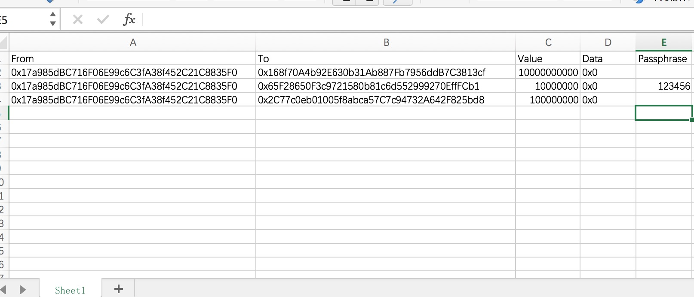

## Ethereum client

Ethereum Easy Client encapsulated with ethclient from go-ethereum

### Installation

> Please make sure you've installed Go tool properly, if you don't have it already, please install golang first).

**1. Download the source code from github**

```Shell
mkdir -p $GOPATH/src/github.com/rjl493456442
cd $GOPATH/src/github.com/rjl493456442
git clone https://github.com/rjl493456442/ethclient
```

**2. Build the source code**

```shell 
cd $GOPATH/src/github.com/rjl493456442/ethclient
go install
```

### Usage

**1. Check out the help manaul**

```Shell
$ ethclient -h
NAME:
   ethclient - ethclient is an easy ethereum client, with which user can interactive with ethereum client easily

USAGE:
   ethclient [global options] command [command options] [arguments...]

VERSION:
   1.0.0-alpha

AUTHOR:
   Gary rong <garyrong0905@gmail.com>

COMMANDS:
     generate   generate new keyfile
     send
     sendBatch
     help, h    Shows a list of commands or help for one command

GLOBAL OPTIONS:
   --help, -h     show help
   --version, -v  print the version
```

**2. Generate single or a batch of ethereum keystore files**

Generate a single keystore file.

```Shell
$ ethclient generate
✔ Passphrase: ******
✔ Confirmation: ******
19:12:22.075 account.go:110 ▶ NOTI  Address: 0x8A3cF0131CF5ed2598C1910b15194b9733498296
```

Or you can generate a batch of keystore files together.

```Shell
$ ethclient generate --number 10 --password 123456
19:13:25.155 account.go:73 ▶ INFO  Generate 10 ethereum account required
19:13:26.153 account.go:110 ▶ NOTI  Address: 0x5A6a7c7D9A4fb9989FAAd6eb8412c08511e3cDB6
...
```

Of course you can specify the keystore directory path. All generated files will be put to the keystore directory. If not been specified, the default path name is `keystore`.

**3. Send single transaction**

You can send a single transaction with specified `sender`, `receiver`, `transfer amount` or `invocation data` fields.

```Shell
ethclient send --sender 0x17a985dBC716F06E99c6C3fA38f452C21C8835F0 --receiver 0x157E526B7e71F6a3189A42ad99A0BCbcCEB555b1 --value 100000000 --password ****** --url <remote ethereum node's rpc url> --keystore ~/project/bigdreamer/test/keystore

▶ NOTI  sendTransaction, hash=0x64912ac4307eb7f44f4940967cdfafee53bd81790ed2035c29b8d9798c193f4f
```

What's more, you can set up `--sync` flag if you want to send the transaction synchronously.

**4. Send a batch of transaction simultaneously**

You can send a batch of transactions simultaneously. The key point of the batch operation is the `batch file`. For the detail description, you can check the appendix section.

```Shell
$ ethclient sendBatch --keystore ~/project/bigdreamer/test/keystore --url http://172.16.5.3:9999  --batchfile ~/Desktop/excel.xlsx

20:08:55.202 send_transaction.go:193 ▶ NOTI  sendTransaction, hash=0x0a972ae96dc50ef4701e21bc6fe25389801286a96decee9a1ffb49a78b640954
20:08:55.299 send_transaction.go:193 ▶ NOTI  sendTransaction, hash=0xb8823ca46731ae1066ad5f0b5e6b8d12119d3a5712c33dd040ff4c8dc203fbd6
20:08:55.399 send_transaction.go:193 ▶ NOTI  sendTransaction, hash=0xae661a83cf7b0d556c25bbb0bcbce43f9cdf7dd4327f01eb405fe6cf2672ebb7
```

**5. Generate invocation payload**

Ethereum users can always find that encode the invocation params to the payload is troublesome. So we provide a command line tool for users to generate payload easily.

> Note this part of function has been finished. Will be published soon.

### Appendix

#### Batch operation file

If ethclient users want to send batch transactions, they need to write down all transaction details to a file we called `batch file`. 

Currently, we support two format `batch file`. One is raw text file and another is `MS Excel`. The `json` format will been supported very soon.

**1. Raw text file format**

The raw text file format is so simple. 

The content of each line in the raw text file represents a transaction's information. In each row, the different fields of the transaction are separated by commas.

The content of each transaction consists of 5 fields：

1. the sender of the transaction
2. the recipient
3. the amount of transfer
4. the call information 
5. the sender keystore file password

Here is an example:

```
0x7236Bc5a9Ff647D48b1eceaa07aa6438dCca615e, 0x168f70A4b92E630b31Ab887Fb7956ddB7C3813cf, 100, 0x123456, helloworld
0x7Cd6342b4b02A90bcf60F1f843d1002897e38b1f, 0x65F28650F3c9721580b81c6d552999270EffFCb1, 100, 0x123456, helloworld
0xfFc1736f670f305A3d752280d07F6895379cbD70, 0x2C77c0eb01005f8abca57C7c94732A642F825bd8, 100, 0x123456, helloworld
```

As for the password filed, it is not a required field in `batch file`. 

You can specify the password either by `password` flag, `passwordfile` flag or in interactive mode.

**2. Excel file format**

Excel format is also supported. The transaction fields are same with raw text file in the above.

A excel format `batch file` looks like:



